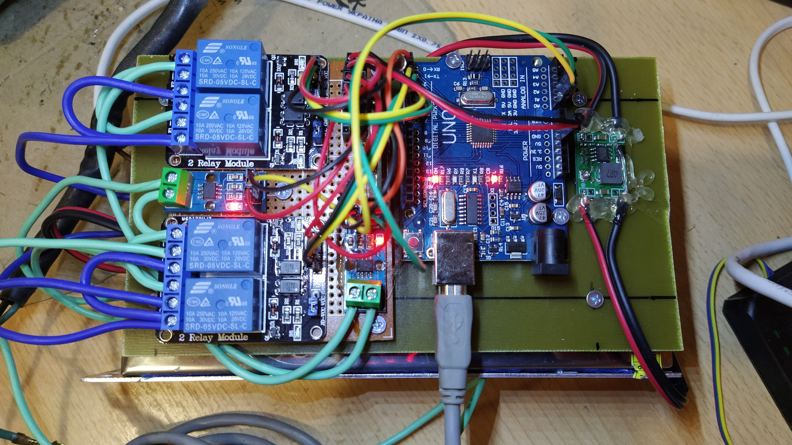

# Задачі для воротної автоматики:

1. опитування rf-приймача
2. Запуск таймерів
   * 4 таймери: на відкриття і закриття обох створок воріт. По закінченню таймерів викликаються фунуції що зупиняють мотори і встановлюють змінні для таймерів відкриття і закриття воріт.
3. керування моторами left leaf: D4;D5, right leaf: D6;D7. (пуск: (1,0), стоп: (0,0), реверс: (0,1)) 
   * приймає команди від радіопульта
   * В залежності від поточного стану (ворота вікриваються, закриваються, закриті чи відкриті) відбуваєть або зупинка моторів і перерахунок часу на відкриття чи закриття кожної створки, або запуск моторів і таймерів.
        
        

## *Комплектуючі:*

### Блок живлення 24В 10А :
  * https://prom.ua/p973067005-blok-pitaniya-24v.html
  * https://ledtechnics.dp.ua/p469385723-blok-pitaniya-24v.html
### Коробка вологозахищена 
  * https://prom.ua/p998541743-korobka-raspayachnaya-km41272.html
  * https://prom.ua/p595636346-korobka-km41272-raspayachnaya.html
### Arduino UNO:
  * http://arduino.ua/prod2610-arduino-uno-r3-ch340
  * https://controller.in.ua/arduino-uno-r3-red-2018
### Реле:
  * http://arduino.ua/prod791-4h-kanalnii-modyl-rele-12v-10a
  * http://arduino.ua/prod201-2-h-kanalnii-modyl-rele-5v-10a-s-optorazvyazkoi
### Датчик струму:
  * http://arduino.ua/prod618-datchik-toka-acs712-30a-gy-712
### RF приймач:
  * http://arduino.ua/prod1812-modyl-sypergeterodinnogo-priemnika-na-433-mhz
  * https://controller.in.ua/srx882-v2-0---besprovodnoj-priemnik-433mgc-s-antenoj
### RF брелок:
  * http://arduino.ua/prod1718-4-h-knopochnii-brelok-distancionnogo-ypravleniya
### Макетна плата:
  * http://arduino.ua/prod367-maketnaya-plata-iz-getinaksa-90-h-150mm
### Стійки для макетної плати:
        
### Понижаючий конвертор:
  * http://arduino.ua/prod650-DC-DC-ponijaushhii-konverter-c-4-5-60V-do-3-35V
  * http://arduino.ua/prod605-dc-dc-ponijaushhii-konverter-3a
### RF антенка:
  * https://controller.in.ua/sw433-th22-
